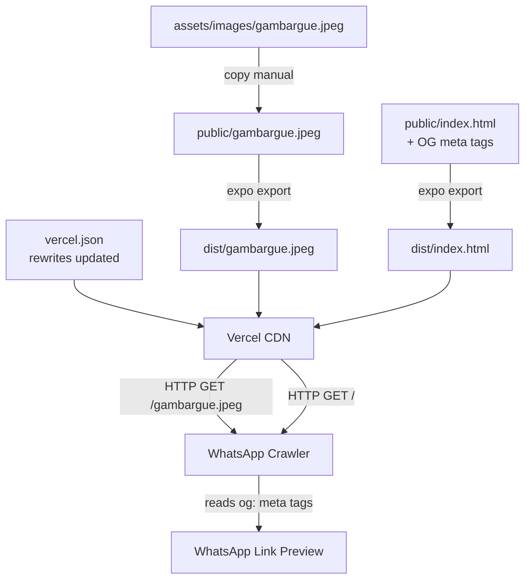

# Design Document: Open Graph Link Preview (WhatsApp)

## Overview

Fitur ini menambahkan Open Graph (OG) meta tags ke web app BPS Sumberharjo yang di-deploy ke Vercel, agar saat link dibagikan di WhatsApp muncul preview berupa gambar thumbnail, judul, dan deskripsi aplikasi.

Karena aplikasi dibangun dengan Expo Router (`output: "static"`) dan di-deploy sebagai SPA di Vercel, pendekatan yang dipilih adalah **static HTML injection** — meta tags ditulis langsung ke `public/index.html` yang menjadi template HTML dasar sebelum bundle JavaScript dimuat. Ini adalah satu-satunya cara yang efektif untuk SPA karena WhatsApp crawler tidak menjalankan JavaScript.

**Keputusan desain utama:**
- OG meta tags ditempatkan di `public/index.html` (bukan via React Helmet atau expo-head) karena WhatsApp crawler membaca HTML statis, bukan hasil render JavaScript.
- Gambar ditempatkan di `public/gambargue.jpeg` agar ter-copy ke `dist/` saat build dan dapat diakses melalui URL publik.
- `vercel.json` diperbarui untuk mengecualikan `/gambargue.jpeg` dari aturan rewrite SPA.

---

## Architecture



**Alur request dari WhatsApp Crawler:**

1. Pengguna mengirim link `https://bps-sumberharjo.vercel.app/` di WhatsApp
2. WhatsApp crawler mengirim HTTP GET ke URL tersebut
3. Vercel melayani `dist/index.html` (karena rewrite `/(.*) → /index.html`)
4. Crawler membaca `<meta property="og:*">` dari `<head>`
5. Crawler mengambil gambar dari `og:image` URL
6. WhatsApp menampilkan preview dengan gambar, judul, dan deskripsi

---

## Components and Interfaces

### 1. `public/index.html` — Template HTML dengan OG Meta Tags

File ini adalah template HTML yang digunakan oleh Expo saat build web. Expo akan menyalin isi `<head>` dari file ini ke output `dist/index.html`.

**Meta tags yang ditambahkan:**

```html
<!-- Open Graph meta tags untuk WhatsApp preview -->
<meta property="og:title" content="BPS Sumberharjo – SE2026 Smart Estimator" />
<meta property="og:description" content="Kalkulator estimasi produksi pertanian SE2026 untuk wilayah Sumberharjo, Bojonegoro. Hitung estimasi padi, jagung, tembakau, dan komoditas lain secara cepat." />
<meta property="og:image" content="https://bps-sumberharjo.vercel.app/gambargue.jpeg" />
<meta property="og:url" content="https://bps-sumberharjo.vercel.app/" />
<meta property="og:type" content="website" />
```

**Catatan penting:**
- `og:image` harus URL **absolut** — WhatsApp crawler tidak mengikuti path relatif
- `og:description` panjangnya antara 10–200 karakter (requirement 1.2)
- Semua tag harus berada di dalam `<head>`, bukan `<body>`

### 2. `public/gambargue.jpeg` — File Gambar OG

File gambar yang disalin dari `assets/images/gambargue.jpeg` ke `public/gambargue.jpeg`. Expo secara otomatis menyalin semua file dari folder `public/` ke root `dist/` saat build, sehingga gambar tersedia di URL `/gambargue.jpeg`.

**Spesifikasi gambar yang direkomendasikan WhatsApp:**
- Rasio aspek: 1.91:1 (landscape) atau 1:1 (square)
- Ukuran minimum: 300×157 px
- Format: JPEG

### 3. `vercel.json` — Konfigurasi Rewrite

Aturan rewrite `/(.*) → /index.html` yang sudah ada perlu diperbarui agar request ke `/gambargue.jpeg` tidak di-rewrite ke `index.html`. Vercel mengevaluasi `rewrites` secara berurutan dan hanya menerapkan aturan pertama yang cocok.

**Strategi:** Tambahkan kondisi `has` pada aturan rewrite yang ada untuk mengecualikan file statis, atau gunakan pola regex yang lebih spesifik.

```json
{
  "buildCommand": "npx expo export --platform web",
  "outputDirectory": "dist",
  "framework": null,
  "rewrites": [
    {
      "source": "/((?!gambargue\\.jpeg).*)",
      "destination": "/index.html"
    }
  ]
}
```

Alternatif yang lebih eksplisit menggunakan `routes` dengan urutan:

```json
{
  "rewrites": [
    { "source": "/gambargue.jpeg", "destination": "/gambargue.jpeg" },
    { "source": "/(.*)", "destination": "/index.html" }
  ]
}
```

**Rekomendasi:** Gunakan negative lookahead regex pada source karena lebih eksplisit dan mudah di-extend untuk file statis lain di masa depan.

### 4. `src/app/_layout.tsx` — Tidak Dimodifikasi

File `_layout.tsx` **tidak perlu diubah**. OG meta tags diinjeksikan melalui `public/index.html`, bukan melalui React component. Struktur `<Stack>` dan `<ThemeProvider>` tetap utuh.

---

## Data Models

Tidak ada data model baru yang diperkenalkan. Semua perubahan bersifat statis (file HTML, gambar, konfigurasi JSON).

**Konstanta yang digunakan:**

| Nilai | Keterangan |
|-------|-----------|
| `og:title` | `"BPS Sumberharjo – SE2026 Smart Estimator"` |
| `og:description` | String 10–200 karakter, mendeskripsikan fungsi kalkulator |
| `og:image` | `"https://bps-sumberharjo.vercel.app/gambargue.jpeg"` (URL absolut) |
| `og:url` | `"https://bps-sumberharjo.vercel.app/"` |
| `og:type` | `"website"` |
| Canonical URL | `https://bps-sumberharjo.vercel.app` |

---

## Correctness Properties

*A property is a characteristic or behavior that should hold true across all valid executions of a system — essentially, a formal statement about what the system should do. Properties serve as the bridge between human-readable specifications and machine-verifiable correctness guarantees.*

**Catatan PBT Applicability:** Fitur ini adalah static HTML configuration — meta tags ditambahkan ke file statis dan konfigurasi JSON diperbarui. Tidak ada pure function dengan input/output yang bervariasi secara bermakna. Hampir semua acceptance criteria berupa pemeriksaan keberadaan nilai tetap (EXAMPLE atau SMOKE), bukan properti universal.

Satu-satunya kandidat property adalah requirement 1.6 — memverifikasi bahwa **semua** OG meta tags (bukan satu tag spesifik) berada di dalam `<head>`. Ini memiliki sifat universal "untuk setiap tag OG yang ada, tag tersebut harus berada di dalam head."

### Property 1: Semua OG meta tags berada di dalam `<head>`

*Untuk setiap* meta tag dengan atribut `property` yang diawali `og:` yang ditemukan di dalam file HTML output build, tag tersebut harus merupakan keturunan langsung dari elemen `<head>` dan tidak boleh berada di dalam elemen `<body>`.

**Validates: Requirements 1.6**

---

## Error Handling

### Kasus 1: File `public/index.html` tidak ada sebelum build

**Gejala:** Build berhasil namun `dist/index.html` tidak mengandung OG meta tags karena Expo menggunakan template default-nya sendiri.

**Mitigasi:** Pastikan file `public/index.html` ada sebelum menjalankan `expo export --platform web`. Verifikasi dengan memeriksa `dist/index.html` setelah build.

### Kasus 2: Gambar tidak ter-copy ke `dist/`

**Gejala:** WhatsApp menampilkan preview tanpa gambar; URL `https://.../gambargue.jpeg` mengembalikan 404.

**Penyebab umum:** File `gambargue.jpeg` tidak ada di folder `public/` (masih di `assets/images/` saja).

**Mitigasi:** Verifikasi keberadaan `public/gambargue.jpeg` sebelum build. Setelah build, cek `dist/gambargue.jpeg`.

### Kasus 3: Vercel meng-rewrite request gambar ke `index.html`

**Gejala:** HTTP GET ke `/gambargue.jpeg` mengembalikan HTML (status 200 tapi Content-Type `text/html`), bukan `image/jpeg`. WhatsApp tidak bisa membaca gambar.

**Mitigasi:** Pastikan `vercel.json` memiliki aturan pengecualian untuk `/gambargue.jpeg`. Uji dengan `curl -I https://bps-sumberharjo.vercel.app/gambargue.jpeg` dan periksa header `Content-Type`.

### Kasus 4: `og:image` menggunakan URL relatif

**Gejala:** WhatsApp menampilkan preview tanpa gambar meskipun file ada.

**Penyebab:** Nilai `og:image` ditulis sebagai `/gambargue.jpeg` (relatif) bukan `https://bps-sumberharjo.vercel.app/gambargue.jpeg` (absolut).

**Mitigasi:** Selalu gunakan URL absolut untuk `og:image`. WhatsApp crawler tidak mengikuti path relatif.

### Kasus 5: WhatsApp cache — preview lama tetap muncul

**Gejala:** Setelah deploy, WhatsApp masih menampilkan preview lama (atau tidak ada preview).

**Mitigasi:** Gunakan [WhatsApp Link Preview Debugger](https://developers.facebook.com/tools/debug/) (Meta Sharing Debugger) untuk memaksa re-fetch meta tags dan clear cache crawler.

---

## Testing Strategy

Fitur ini adalah perubahan konfigurasi statis. PBT tidak sesuai untuk keseluruhan fitur karena tidak ada pure function dengan input space yang luas. Strategi pengujian menggunakan kombinasi **smoke tests** dan **example-based tests** ditambah satu **property test** untuk requirement 1.6.

### Unit / Example Tests

Dilakukan dengan membaca file output setelah build:

| Test | Apa yang diverifikasi | Requirement |
|------|----------------------|-------------|
| `og:title` hadir di `<head>` | Nilai tepat `"BPS Sumberharjo – SE2026 Smart Estimator"` | 1.1 |
| `og:description` hadir di `<head>` | Panjang teks antara 10–200 karakter | 1.2 |
| `og:image` hadir di `<head>` | Nilai adalah URL absolut yang mengandung `gambargue.jpeg` | 1.3 |
| `og:url` hadir di `<head>` | Nilai adalah URL absolut valid | 1.4 |
| `og:type` hadir di `<head>` | Nilai tepat `"website"` | 1.5 |

### Property Test

Untuk requirement 1.6, implementasi dengan library HTML parser:

```
Feature: open-graph-link-preview, Property 1: Semua OG meta tags berada di dalam <head>
```

Strategi: Parse `dist/index.html`, temukan semua elemen `<meta>` dengan atribut `property` berawalan `og:`, dan verifikasi **semuanya** berada di dalam `<head>` — bukan `<body>` atau level lain. Test ini dijalankan satu kali (bukan 100 iterasi) karena input-nya adalah file statis tunggal, namun bersifat universal terhadap seluruh set OG meta tags yang ada.

### Smoke Tests

Dijalankan setelah deploy ke Vercel:

| Test | Cara | Requirement |
|------|------|-------------|
| `public/gambargue.jpeg` ada di filesystem | `fs.existsSync('public/gambargue.jpeg')` | 2.2 |
| `dist/gambargue.jpeg` ada setelah build | Cek file setelah `expo export` | 2.2 |
| `vercel.json` mengecualikan `/gambargue.jpeg` dari rewrite | Baca dan parse `vercel.json` | 2.3 |
| HTTP GET `/gambargue.jpeg` → 200 + `image/jpeg` | `curl -I` atau fetch ke URL | 2.1 |
| App masih bisa dibuka di browser tanpa error | Manual / E2E browser test | 3.1 |
| `_layout.tsx` masih merender Stack dan ThemeProvider | Baca file, cek komponen ada | 3.2 |

### Cara Verifikasi WhatsApp Preview Secara Manual

1. Deploy ke Vercel
2. Buka [Meta Sharing Debugger](https://developers.facebook.com/tools/debug/) dengan URL app
3. Klik "Fetch new information" untuk clear cache crawler
4. Bagikan link di WhatsApp dan verifikasi preview muncul dengan gambar, judul, dan deskripsi yang benar
